## 输出语法：

###  语法1：

``````javascript
document.write('要输出的内容')
``````

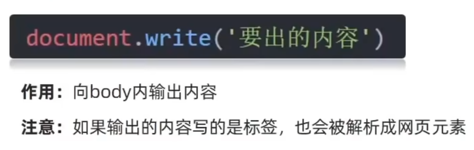


### 语法2：

```javascript
console.log('控制台打印')
```

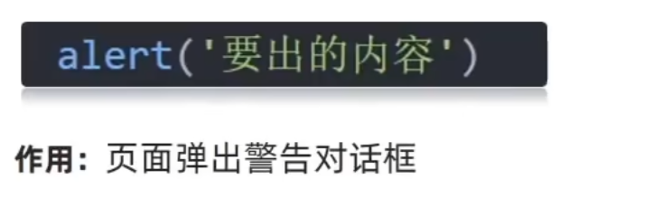

### 语法3：

``````javascript
console.log('控制台打印')
``````

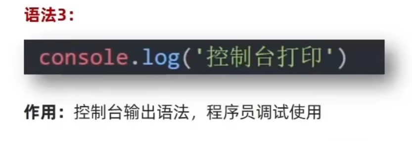

## 输入语法：

```javascript
prompt('输入内容')
```

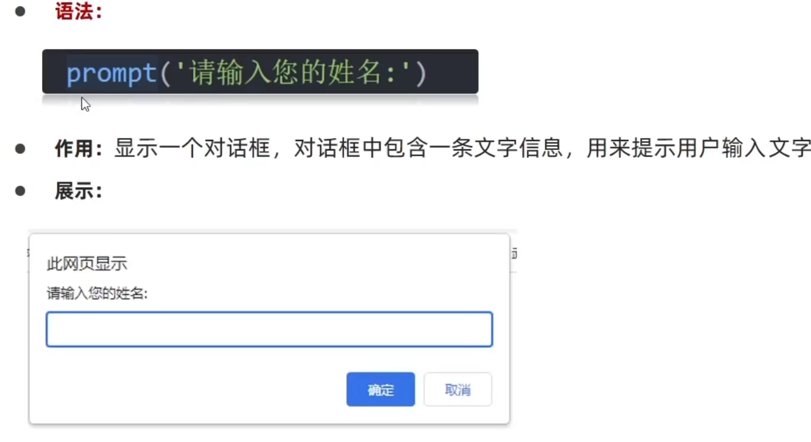

## 变量：

### 1.单一变量

```javascript
let age<!--变量名字——>
```

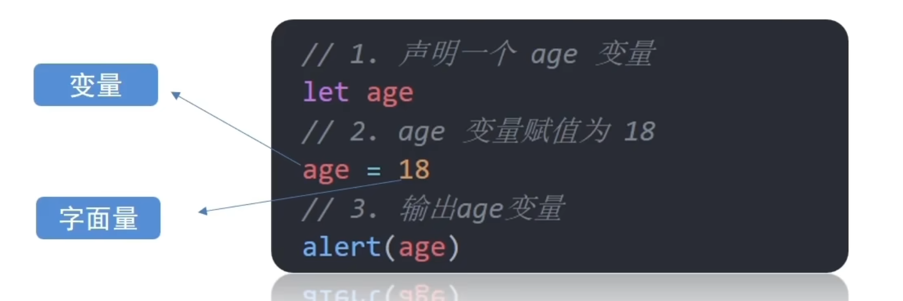

书写规范：


### 2.数组变量

```javascript
let 数组名 = [数据0，数据1， 数据2， 数据3， ....]
```

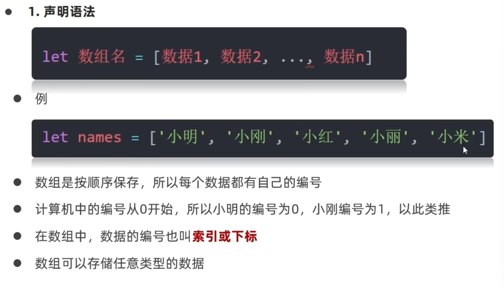

使用数组：打印11

[^内容引用从0开始]: 

```javascript
let arr = ['11', '22', '33']
console.log(arr[0])
```

### 3.修改数组：

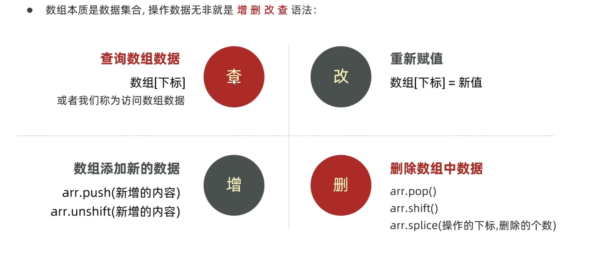

#### 添加数组：

```javascript
arr.push//添加到数组末尾
arr.unshift//添加到数组前面
```

#### 删除数组：

```javascript
arr.shift()//删除数组第一个元素
arr.pop()//删除数组最后一个元素
arr.splice(start/*起始位置*/, deleteCount/*删除几个元素*/)
```

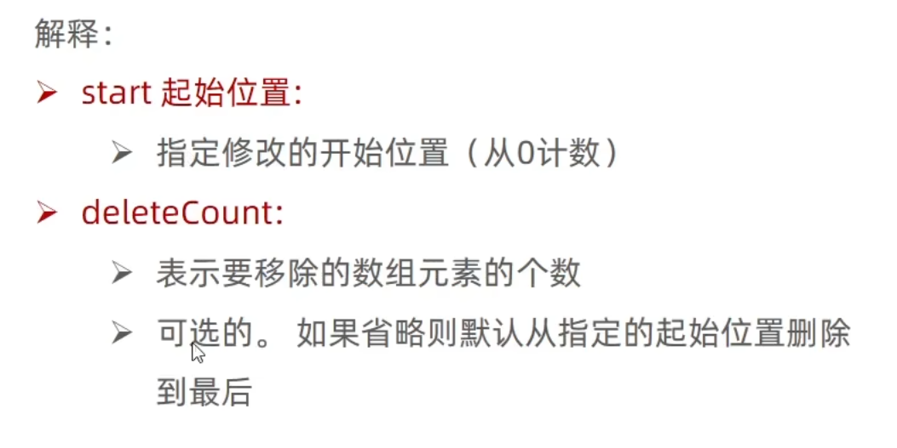


## 常量：

```javascript
const 常量名 = 
```

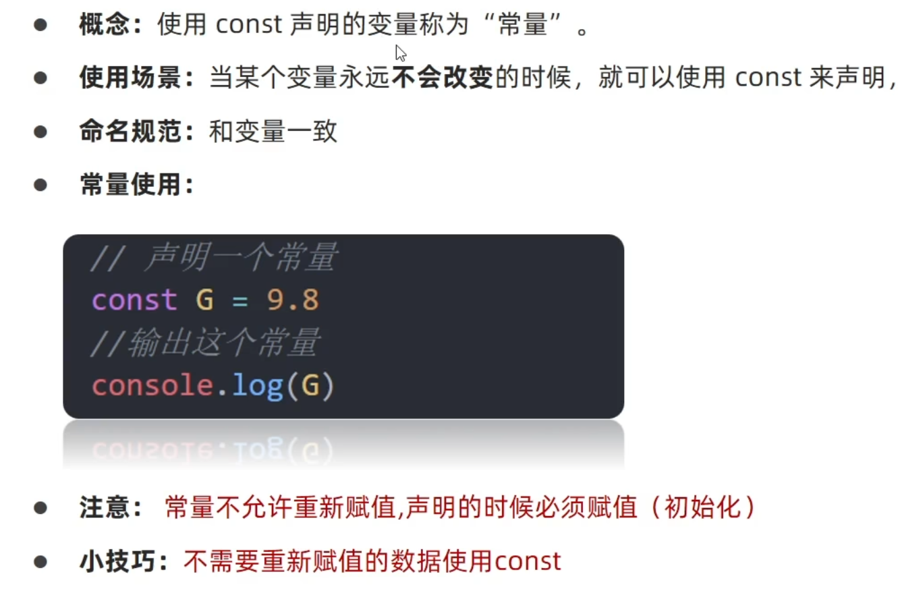

## 模板字符串：

```javascript
document.write(`大家好，我叫${变量名}， 今年${变量名}`)
```

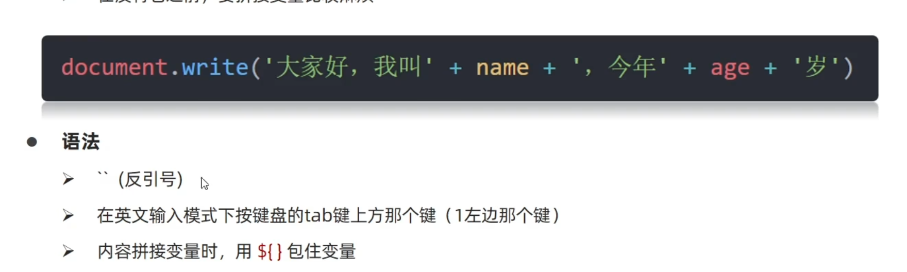

## 运算符：

### 赋值运算符：

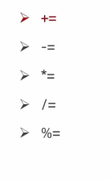

```javascript
let num = 1
num += 1
console.log(num)//结果是2
```

### 逻辑运算符：

| 符号 |  名称  | 日常读法 |             特点             |
| :--: | :----: | :------: | :--------------------------: |
|  &&  | 逻辑与 |   并且   | 符号两边都为true，结果为true |
| \|\| | 逻辑或 |   或者   |  符号两边有一个true就为true  |
|  !   | 逻辑非 |   取反   |   true变false，false变true   |


### 运算符运算顺序：

| 优先级 | 运算符     | 顺序             |
| :----- | ---------- | ---------------- |
| 1      | 小括号     | （）             |
| 2      | 一元运算符 | ++ -- !          |
| 3      | 算数运算符 | 先 *  /  % 后+ - |
| 4      | 关系运算符 | >  >=    <   <=  |
| 5      | 相等运算符 | == != === !==    |
| 6      | 逻辑运算符 | 先&& 后\|\|      |
| 7      | 赋值运算符 | =                |
| 8      | 逗号运算符 | ,                |


## 分支语句

### if语句：

按顺序逐一判断，有一个能满足就结束执行

```javascript
if（条件）{
    执行代码
}
else if（条件）{
    执行代码
}
else{
    执行代码
}
```


### 三元运算符：

```javascript
条件 ? 满足条件的代码 : 不满足条件的代码
let sum = 3 < 5 ？3 ：5
//满足的话就赋值3 不满足就赋值5
```

### switch语句：

```javascript
switch(数据){
    case 值1:
    	代码1
        break//退出switch
    case 值2:
    	代码2
        break//退出switch
    default:
    	代码n
        break//退出switch
}
```


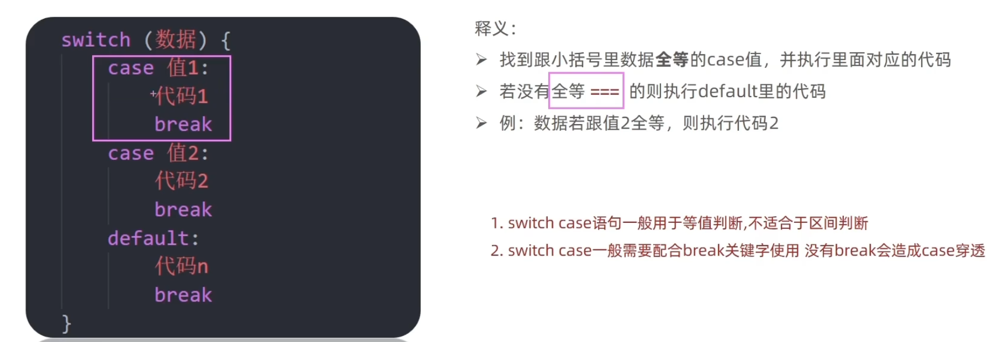

## 循环语句：

```javascript
while(循环条件){
    要重复执行的代码(循环体)
}!
```

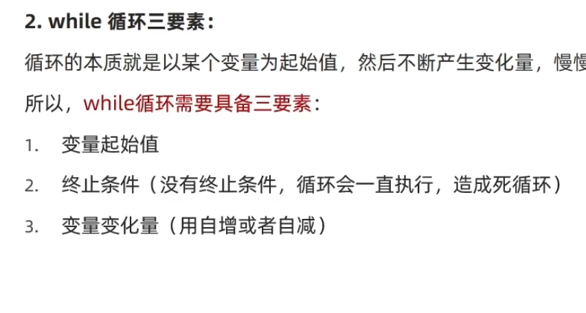

```javascript
let a = 1
while (a <=3){
    document.write(`循环3次<br>`)
    a++
}
```

### 退出循环：

```javascript
continue和break都可退出循环
continue 结束本次循环，继续下次循环
break 退出整个循环
```

#### 这是break循环实例

```javascript
let i = 1
        while (i <=5){
            if(i ===4){
                break
            }
            document.write(`这是${i}循环<br>`)
            i++
        }
```

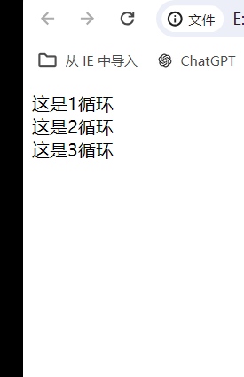

#### 这是continue循环实例

```javascript
       let i = 1
        while (i <=5){
            if(i ===4){
                i++//不加会死循环
                continue
            }
            document.write(`这是${i}循环<br>`)
            i++
        }
```

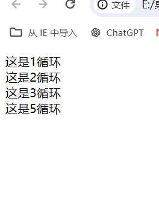

### 银行存取款实例（循环）

```javascript
        let m = 100
        while (true){
            let a = +prompt(`
                请您选择操作:
                1.存钱
                2.取钱
                3.查询余额
                4.退出
            `)
            if(a === 4){
                break
            }
            switch (a) {
                case 1:
                    let cun = +prompt(`输入金额`)
                    m = m +cun
                    break
                    
                case 2:
                    let qu = +prompt(`输入金额`)
                    m = m - qu
                    break
                    
                case 3:
                    alert(`银行卡余额${m}`)
                    break
                    
                }
            }
```

## if和switch判断语句使用情况：

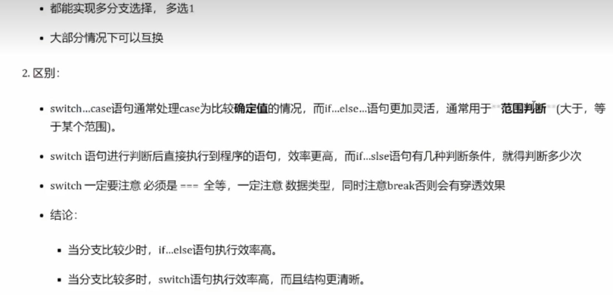


### for循环语句：

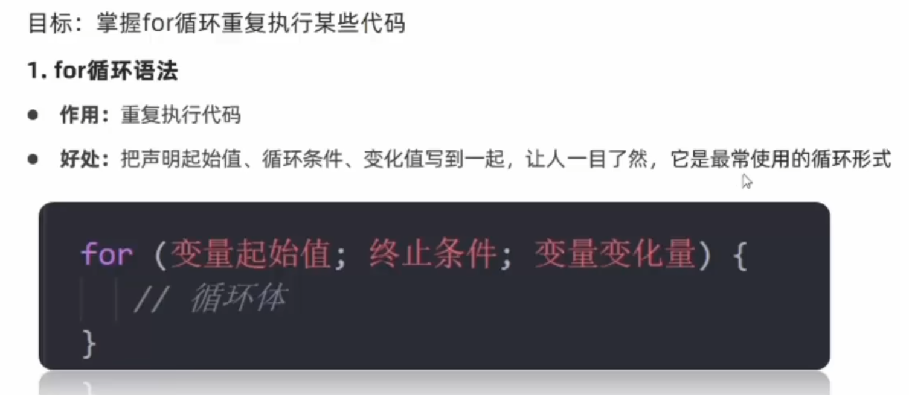

```javascript
let arr = [`1`,`2`,`3`,`4`,`5`,`6`]
        for(let a = 0; a< arr.length/*数组长度,从0开始*/ ;a++){
            document.write(arr[a])
        }
```

## 函数：

### 函数声明：

```javascript
function 函数名(){
    函数体
}
```

### 函数调用：

```javascript
//函数声明
function sayHi(){
    console.log(`hi`)
}
//函数名（）
//调用函数，函数不调用，自己不执行
sayHi()
```

### 返回函数：

```javascript
//return
function num(){
    return 20//直接把值返回给函数名（num）
    //return后的代码不会给执行（建议放在代码最后一行）
}
```

## 对象：

```javascript
let 对象名{
    属性名：属性值，
    方法名：函数
}
```

```javascript
let obj= {
    unmame:'pink老师'，
    age:18,
    gender:'女'
}
```

| 对象查语法   | 对象名.属性      |
| ------------ | ---------------- |
| 对象改语法   | 对象名.属性=新值 |
| 对象语法修改 | 对象名.属性=新值 |

### 内置对象：

Math对象包含的方法：

| random | 生成0-1之间的随机数（包含0不包含1） |
| ------ | ----------------------------------- |
| ceil   | 向上取整                            |
| floor  | 向下取整                            |
| max    | 找最大数                            |
| min    | 找最小数                            |
| pow    | 幂运算                              |
| abs    | 绝对值                              |

生成0-10的随机数

```javascript
Math.floor(Math.randow/*随机数*/() * (10+1))
```

生成5-10的随机数

```javascript
Math.floor(Math.randow() * (5 + 1)) + 5
```

生成N-M之间的随机数

```javascript
Math.floor(Math.randow() *(M - N + 1)) + N
```

